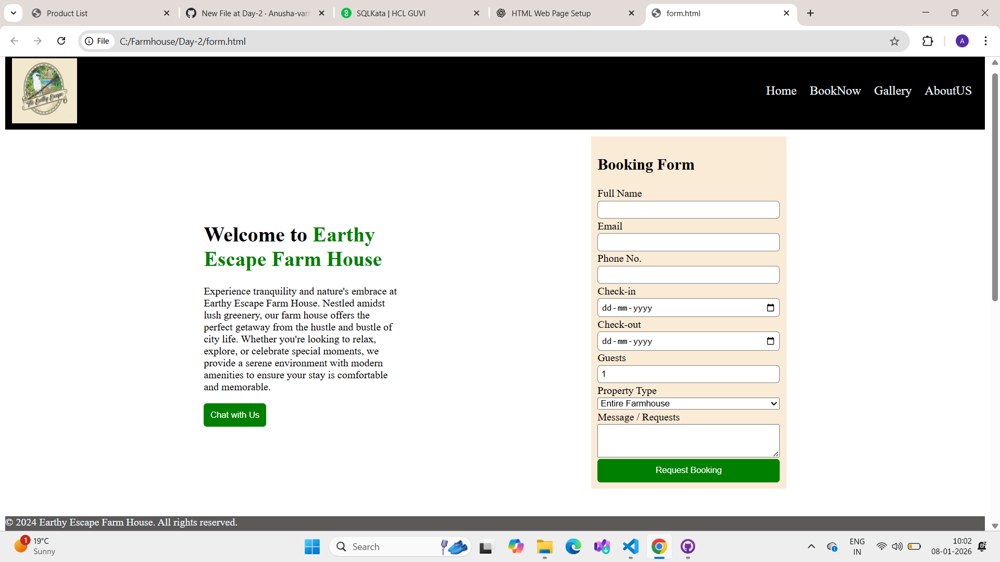
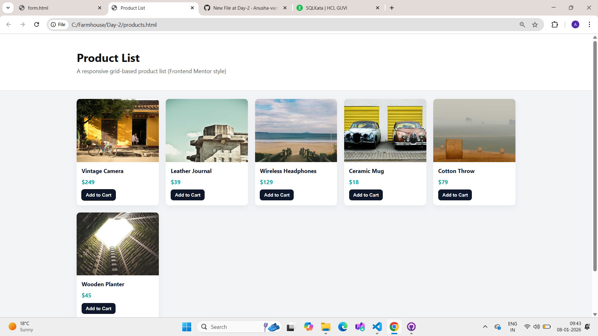

---

## 📌 Earthy Escape – Responsive Web Pages

This project contains **two responsive frontend pages** built using **HTML & CSS**

1. **Farm House Booking Page** – uses **Flexbox**
2. **Product List Page** – uses **CSS Grid (Frontend Mentor style)**

---

## 🧩 Pages Included

### 1️⃣ Farm House Booking Page

* Navigation bar with logo and links
* Hero section with welcome text
* WhatsApp “Chat with Us” button
* Booking form (name, email, phone, dates, guests, property type, message)
* Footer section

📱 **Responsive using Flexbox**

---

### 2️⃣ Product List Page

* Grid-based product listing
* Each product card includes:

  * Image
  * Product title
  * Price
  * “Add to Cart” button
* Inspired by **Frontend Mentor Product List layout**

📱 **Responsive using CSS Grid**

---

## ❓ Answers to Given Questions

### ✅ **Q1. Responsive Flexbox Layout**

* Implemented in the **Farm House Booking Page**
* Layout uses **Flexbox** for:

  * Navigation bar
  * Form + content alignment
* Page adjusts smoothly on different screen sizes

---

### ✅ **Q2. Build Grid-based Product List Layout (Frontend Mentor)**

* Implemented in the **Product List Page**
* Uses **CSS Grid**
* Clean card-based UI similar to Frontend Mentor designs

---

### ✅ **Q3. Make Product List Page Responsive (Mobile / Tablet / Desktop)**

* Responsiveness is achieved **through CSS Grid behavior**
* The grid adapts automatically using properties like:

  * `grid-template-columns`
  * `repeat(auto-fit, minmax(...))` **OR**
  * Media queries in `products.css`

This allows:

* **Mobile:** 1 column
* **Tablet:** 2 columns
* **Desktop:** 3 or more columns

➡️ Even without changing HTML, the layout adjusts based on screen width.

---

## 🛠️ Technologies Used

* HTML5
* CSS3
* Flexbox
* CSS Grid

---

## 📸 Screenshots

### Farm House Booking Page

> *(Add screenshots here)*

### Product List Page

> *(Add screenshots here)*

---

## 📂 Project Structure

```
/project-folder
│
├── index.html        (Farm House Booking Page)
├── form.css
│
├── products.html     (Product List Page)
├── products.css
│
└── README.md
```
